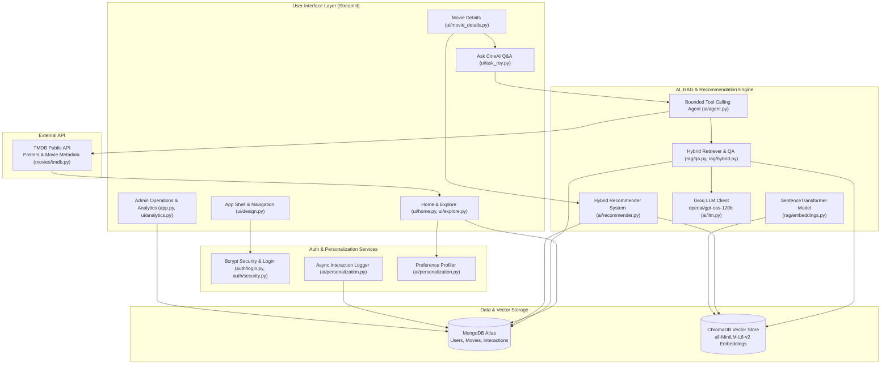

# CineAI : a personal AI-powered movie review platform


> CineAI is an AI-powered personal movie review journal created by Arpon and Sonal. It bridges personal film criticism with modern Generative AI, Retrieval-Augmented Generation (RAG), vector similarity search, hybrid content recommendation, and real-time interaction analytics.

---

## Table of Contents

- [Overview](#overview)
- [Key Features](#key-features)
- [Tech Stack](#tech-stack)
- [Architecture Overview](#architecture-overview)
- [Project Structure](#project-structure)
- [Setup & Installation](#setup--installation)
- [Usage Walkthrough](#usage-walkthrough)
- [Screenshots](#screenshots)
- [Future Scope](#future-scope)
- [Contributing](#contributing)
- [License](#license)
- [Contact](#contact)

---

## Overview

**CineAI** is a full-stack Python application built on **Streamlit** that transforms personal film journals into an interactive, intelligent movie discovery system. Designed specifically as a personal movie journal for Arpon and Sonal, the platform hosts curated reviews, numerical ratings (1–5 stars), verdict classifications (`Must Watch`, `Good Watch`, `Don't Watch`), and zone-based categorization.

### Core Philosophy
* **Grounded Source of Truth:** Generative AI assists with explanation and conversation, but personal reviews recorded in MongoDB remain the definitive source of truth.
* **Grounded RAG Guardrails:** The system prioritizes personal notes over public metadata, preventing hallucinated reviews or invented ratings.
* **Hybrid Intelligence:** Structured MongoDB queries handle exact factual filters, while ChromaDB vector retrieval powers semantic, opinion-based Q&A.

---

## Key Features

### 🎬 Personal Review Journal & Explore
* **Browsable Collection:** Explore detailed reviews, release years, zones (Bollywood, Tollywood, Hollywood, South Indian, Bengali, Other), and genre tags.
* **Verdict Filtering:** Instant single-click filtering across `Must Watch`, `Good Watch`, and `Don't Watch` films.
* **5-Star Rating System:** Granular 1 to 5 star personal rating scale with visual indicators.
* **Search System:** Search across titles with real-time database matching.

### 🤖 Ask CineAI (RAG & Agentic Q&A)
* **Grounded Q&A Engine:** Natural language conversational assistant powered by Groq (`openai/gpt-oss-120b`).
* **Movie-Scoped Retrieval:** Assembles relevant chunks from ChromaDB for deep dive Q&A on specific film detail pages.
* **Bounded Agentic Routing:** Uses function calling (`search_movies`, `filter_by_verdict`, `filter_by_rating`, `retrieve_review`, `general_semantic_search`, `get_public_movie_info`) to execute multi-tool lookups.
* **Fact Fallback to TMDB:** When user queries ask about external film facts (runtimes, cast details, plot overview) missing from personal notes, the agent queries TMDB explicitly, marking the data source clearly.

### 🍿 Hybrid Content Recommendation Engine
* **Multi-Component Scoring:** Computes recommendation affinity using five weighted components:
  * Vector Embedding Similarity (50%) — `SentenceTransformer("all-MiniLM-L6-v2")`
  * Lexical Review Content Similarity (18%) — Word overlap analysis
  * Genre Affinity Overlap (14%) — Direct and family genre matching
  * Personalization Taste Match (10%) — Inferred user interaction profile
  * Personal Rating Quality Score (8%) — Normalized star rating
* **Safety Filtering:** Excludes `Don't Watch` films from recommendations unless no eligible alternatives exist.

### 👤 Non-Blocking Personalization Engine
* **Asynchronous Event Logging:** Non-blocking background thread pool (`ThreadPoolExecutor`) logs user activities (`viewed`, `searched`, `asked_roy`, `favorited`).
* **Dynamic Taste Profiling:** Aggregates interaction history in MongoDB to calculate genre and zone affinity once a threshold of 5 interactions is reached.

### 📊 Real-Time Analytics Dashboard
* **Aggregation Pipelines:** Performs server-side MongoDB aggregation for read-only analytics.
* **Altair Visualizations:** Interactive charts for rating distributions, verdict splits, genre preferences, zone-wise ratings, and year-wise trends.
* **Top-Rated Showcase:** Automated top 10 highest-rated films leaderboard.

### 🔐 Authentication & Admin Management
* **Bcrypt Password Hashing:** Secure authentication flow for registered users and administrative accounts.
* **Review Operations:** Dedicated admin portal to write, edit, confirm, and toggle RAG ingestion status for reviews.
* **Session Management:** Secure Streamlit session state isolation between users and admins.

---

## Tech Stack

| Category | Technology | Purpose |
| :--- | :--- | :--- |
| **Frontend / Web Framework** | [Streamlit 1.63.0](https://streamlit.io/) | Web UI, reactive page routing, and design system |
| **Data Visualization** | [Altair 6.2.2](https://altair-viz.github.io/) | Interactive analytics charts and plots |
| **Database** | [MongoDB Atlas](https://www.mongodb.com/) (PyMongo 4.18.0) | Document store for users, reviews, and interaction logs |
| **Vector Database** | [ChromaDB 1.5.9](https://www.trychroma.com/) | Persistent local vector store for review embeddings |
| **Embedding Model** | [Sentence Transformers 6.0.1](https://www.sbert.net/) | `all-MiniLM-L6-v2` dense vector embeddings |
| **LLM Provider** | [Groq SDK 1.7.0](https://groq.com/) | High-speed LLM inference running `openai/gpt-oss-120b` |
| **Metadata API** | [TMDB API](https://www.themoviedb.org/) (Requests 2.34.2) | External poster URLs, cast overviews, and release data |
| **Security & Utilities** | Bcrypt 5.0.0, Python-Dotenv, Pydantic | Password hashing, env configuration, schema validation |
| **Testing** | Pytest 9.1.1 | Unit, integration, and RAG evaluation test suite |

---

## Architecture Overview

The system follows a modular, layered architecture separating user interface, application services, retrieval routing, storage engines, and external AI providers.



---

## Project Structure

```
RoyReview/
├── .streamlit/
│   └── secrets.toml              # Local environment configuration & API keys (Git-ignored)
├── ai/
│   ├── __init__.py
│   ├── agent.py                  # Bounded tool-calling agent for Ask CineAI Q&A
│   ├── llm.py                    # Groq LLM API wrapper (openai/gpt-oss-120b)
│   ├── personalization.py        # Async interaction logging & user preference profiler
│   └── recommender.py            # Hybrid recommendation algorithm (5-component score)
├── auth/
│   ├── __init__.py
│   ├── login.py                  # Login handler & admin authentication
│   ├── security.py               # Bcrypt password hashing & verification
│   └── signup.py                 # User registration workflow
├── chroma_db/                    # Local persistent ChromaDB vector store directory
├── config/
│   ├── __init__.py
│   └── settings.py               # Application configuration & recommendation weights
├── database/
│   ├── __init__.py
│   ├── models.py                 # User document builders & public projections
│   └── mongodb.py                # Lazy MongoDB Atlas client & collection getters
├── movies/
│   ├── __init__.py
│   ├── imdb.py                   # IMDb metadata helpers
│   ├── movie_service.py          # Movie domain service interface
│   └── tmdb.py                   # TMDB REST API client & metadata enrichment
├── rag/
│   ├── __init__.py
│   ├── bootstrap.py              # Vector store initialization check
│   ├── embeddings.py             # SentenceTransformer embedding model wrapper
│   ├── evaluation.py             # RAG precision, recall & faithfulness metrics
│   ├── hybrid.py                 # Hybrid exact-filtering logic
│   ├── ingest.py                 # RAG ingestion utilities
│   ├── prompts.py                # System and user prompts for RAG
│   ├── qa.py                     # Hybrid RAG question answering pipeline
│   ├── retriever.py              # ChromaDB context retrieval logic
│   └── vector_store.py           # ChromaDB collection lifecycle & query wrappers
├── scripts/
│   ├── build_embeddings.py       # Script to embed confirmed movies into ChromaDB
│   ├── import_movies.py          # CSV import script with TMDB metadata enrichment
│   ├── rebuild_embeddings.py     # Script to reset and rebuild vector store
│   ├── run_rag_eval.py           # Script to evaluate RAG accuracy on test set
│   └── tune_recommender.py       # Recommendation weight tuning utility
├── tests/                        # Comprehensive Pytest suite
│   ├── conftest.py
│   ├── rag_eval/
│   │   └── eval_set.json         # Labeled RAG evaluation dataset
│   ├── test_agent.py
│   ├── test_analytics.py
│   ├── test_auth.py
│   ├── test_database.py
│   ├── test_evaluation.py
│   ├── test_hybrid.py
│   ├── test_movies.py
│   ├── test_personalization.py
│   ├── test_qa.py
│   ├── test_rag.py
│   ├── test_rag_grounding.py
│   ├── test_rebuild.py
│   ├── test_recommender.py
│   ├── test_resilience.py
│   └── test_smoke.py
├── ui/
│   ├── __init__.py
│   ├── analytics.py              # Admin MongoDB aggregation charts (Altair)
│   ├── ask_roy.py                # Inline Ask CineAI Q&A component
│   ├── dashboard.py              # Supplemental dashboard components
│   ├── design.py                 # CSS design system & navigation components
│   ├── explore.py                # Verdict & 5-star collection filtering UI
│   ├── home.py                   # Home view & search results UI
│   ├── movie_details.py          # Movie details & recommendations layout
│   └── profile.py                # User profile view & editor
├── app.py                        # Main Streamlit application entry point
├── requirements.txt              # Complete Python dependency manifest
└── README.md                     # Project documentation
```

---

## Setup & Installation

### Prerequisites
* **Python 3.10+** installed locally.
* **MongoDB Atlas** cluster URI (or local MongoDB server instance).
* **TMDB API Key** (v3 API Key from [The Movie Database](https://www.themoviedb.org/documentation/api)).
* **Groq API Key** (from [Groq Console](https://console.groq.com/)).

### 1. Clone the Repository
```bash
git clone https://github.com/ArponRoy007/RoyReview.git
cd RoyReview
```

### 2. Create and Activate Virtual Environment
```bash
python -m venv venv
source venv/bin/activate  # On Windows: venv\Scripts\activate
```

### 3. Install Dependencies
```bash
pip install -r requirements.txt
```

### 4. Configure Streamlit Secrets
Create a secrets file at `.streamlit/secrets.toml`:

```toml
# MongoDB Atlas Connection
MONGODB_URI = "mongodb+srv://<username>:<password>@<cluster>.mongodb.net/?retryWrites=true&w=majority"
DATABASE_NAME = "royreview"
MOVIES_COLLECTION_NAME = "movies"
USERS_COLLECTION_NAME = "users"
USER_INTERACTIONS_COLLECTION_NAME = "user_interactions"

# External API Keys
TMDB_API_KEY = "your_tmdb_api_key_here"
GROQ_API_KEY = "your_groq_api_key_here"

# Admin Authentication
ADMIN_USERNAME = "admin"
ADMIN_PASSWORD = "your_admin_password_here"
```

### 5. Ingest Movies & Build Embeddings
If setting up a fresh database, run the import and embedding scripts:
```bash
# 1. Import base movie dataset & enrich with TMDB metadata
python scripts/import_movies.py

# 2. Build ChromaDB vector embeddings for RAG
python scripts/build_embeddings.py
```

### 6. Run the Application
Launch the Streamlit web interface:
```bash
streamlit run app.py
```
Open `http://localhost:8501` in your browser.

---

## Usage Walkthrough

1. **User Authentication:**
   * Launch the app and sign up for a personal account or sign in with existing credentials.
   * Admins sign in using configured secret credentials to access the admin portal.
2. **Search & Explore Collections:**
   * Browse film cards on the home screen or enter search terms in the top search bar.
   * Click verdict buttons (`Must Watch`, `Good Watch`, `Don't Watch`) to immediately filter movies by status.
3. **Inspect Movie Reviews & Details:**
   * Click **View review** on any film card to view the movie detail view.
   * Read personal ratings, verdicts, zone classification, poster artwork, and full review text.
4. **Interact with Ask CineAI:**
   * Scroll to the **Ask CineAI** section on a movie page or ask general collection questions.
   * Choose pre-set questions like *"What makes this movie worth watching?"* or type custom natural language queries.
   * View grounded AI answers along with highlighted source notes or TMDB attribution.
5. **Personalized Recommendations:**
   * As you view, search, and ask about movies, the non-blocking background logger builds your personal taste profile.
   * Explore the **You might also like** carousel on movie detail pages to discover high-affinity recommendations.

---

## Screenshots

> [!NOTE]
> Add application screenshots to `docs/screenshots/` to display visual previews here.

| Section | Preview |
| :--- | :--- |
| **Home & Explore** | `` *(Place home.png in `docs/screenshots/`)* |
| **Movie Details & Recommendations** | `` *(Place movie_details.png in `docs/screenshots/`)* |
| **Ask CineAI Q&A** | `` *(Place ask_cineai.png in `docs/screenshots/`)* |
| **Admin Operations & Analytics** | `` *(Place admin_dashboard.png in `docs/screenshots/`)* |

---

## Future Scope

> [!IMPORTANT]
> The features listed below represent planned enhancements and architectural extensions. They are intentionally kept distinct from the currently implemented functionality described above.

* **Planned: Multi-Modal Voice & Chat Interfaces** — Integrating real-time speech-to-text input for hands-free Q&A in Ask CineAI.
* **Planned: Automated RAG Evaluation Pipeline** — Expanding `scripts/run_rag_eval.py` into a continuous CI/CD evaluation step using RAGAS or synthetic test suites.
* **Planned: Advanced Collaborative Filtering** — Enhancing the hybrid recommendation algorithm with user-to-user similarity matrix computations once the registered user base scales.
* **Planned: Social Features & Journal Sharing** — Allowing users to build shared playlists, movie watchlists, and publish user-generated reviews alongside Roy's reviews.
* **Planned: Predictive Rating Insights** — Admin-facing analytics leveraging historical reviews to predict potential ratings for upcoming film releases.

---

## Contributing

Contributions, bug reports, and feature proposals are welcome! 

1. Fork the repository.
2. Create a feature branch (`git checkout -b feature/amazing-feature`).
3. Commit your changes (`git commit -m 'Add amazing feature'`).
4. Push to the branch (`git checkout -b feature/amazing-feature`).
5. Open a Pull Request.

---

## License

*(Placeholder: Specify repository license file, e.g. MIT License. See [LICENSE](LICENSE) file if available).*

---

## Contact

- **Project Lead:** Arpon Roy ([@ArponRoy007](https://github.com/ArponRoy007)) & Sonal
- **Repository:** [https://github.com/ArponRoy007/RoyReview](https://github.com/ArponRoy007/RoyReview)
